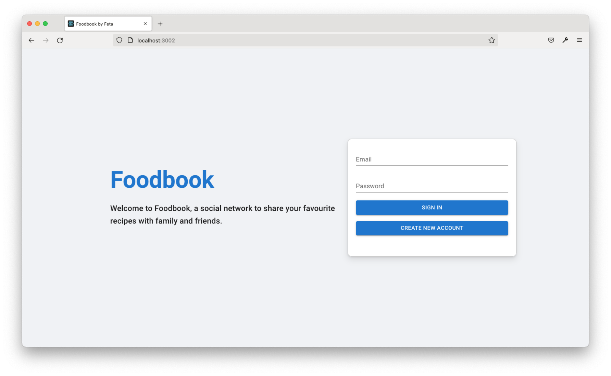
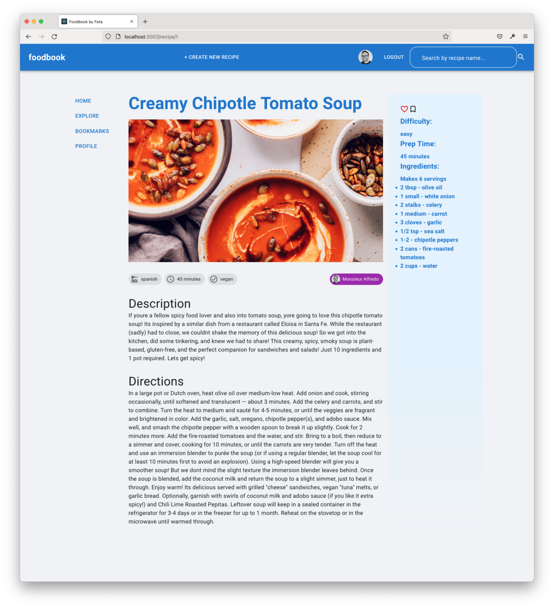
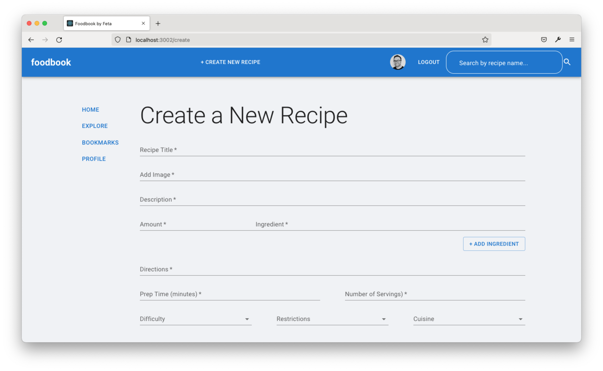
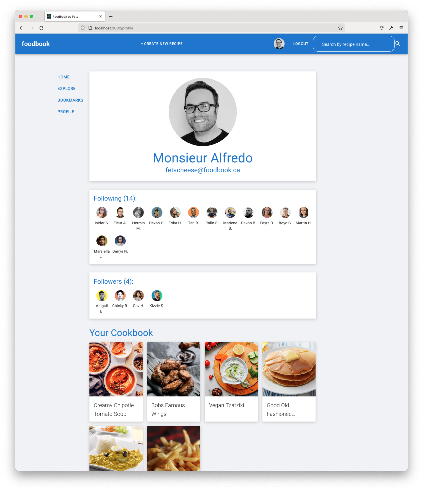

# FoodBook by Feta

Foodbook is a social recipe sharing app, to help people share their recipes with family and friends.

## Screen Shots

Login Page:

Feed Page:

Recipe Page:

Recipe Form Page:

User Page:

## Dev Notes

**User Login**:
fetacheese@foodbook.ca /
testuser

## Tech Stack

## Team

